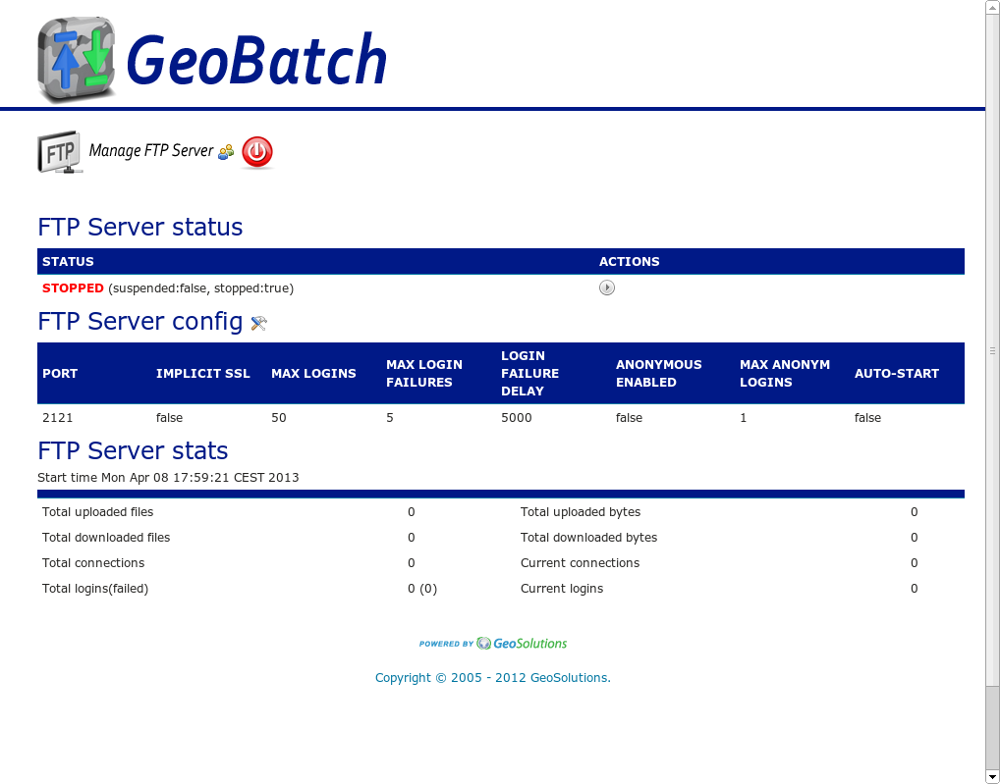
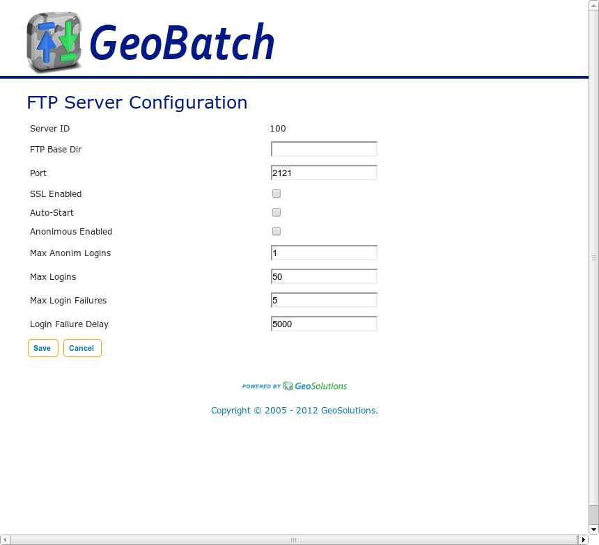

.. |GB| replace:: *GeoBatch*

Embedded FTP server and User Management
=======================================

|GB| is released with an usefull embedded FTP Server with which an admin could easilly grant access to users via FTP protocol.

Login as Admin and Access to FTP administration panel clicking on *Manage ftp and users* section in HomePage:

By default the FTP server is turned off, start it clicking on |start| start button.

General Configurations
----------------------

You can customize the general server properties clicking on config |config| button.

The General configuration options are:

User management
---------------

To configure or add user click on the user icon |handle_users| at left of logout button.

For each users it could be possible set the permission for files upload that can be processed by |GB|.

An admin can select which flows each user is allowed to and other several properties.

.. figure:: images/ftp_user_panel.jpg
   :align: center
   
Click on |config| button and you can change the user properties.

Note 2 important properties:

**ALLOWED FLOWS**:

Specify on wich flows the user is allowed to upload data to be processed by |GB|.

**ROLE**:

*ROLE_ADMIN* is the administrator of GB and with this role you have every type of access.

*ROLE_POWERUSER* can write in allowed flow dirs and have control for start/stop/pause flows.

*ROLE_USER* can only write in allowed flow dirs.

