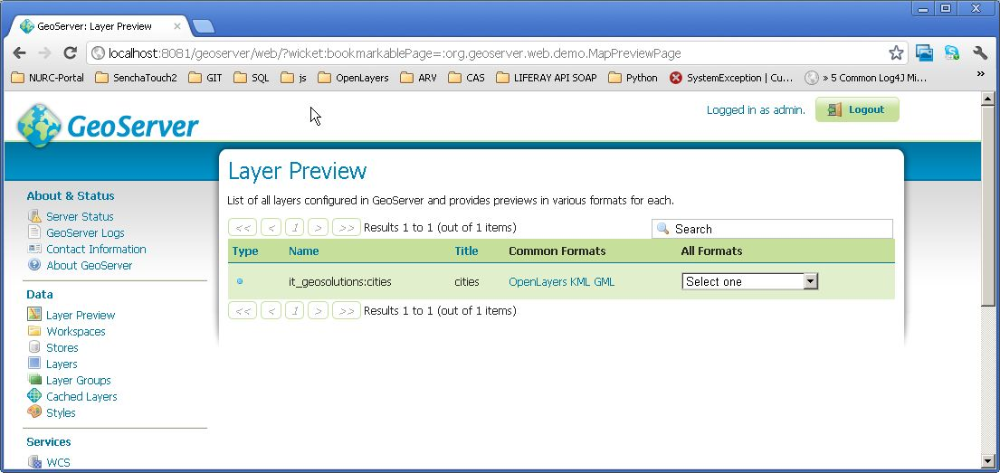
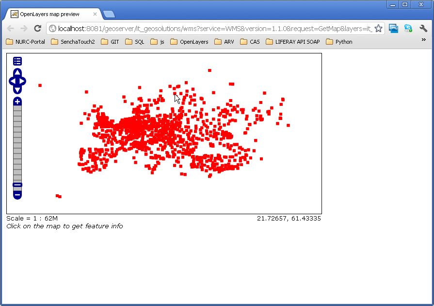

.. |GB| replace:: *GeoBatch*
.. |demo| replace:: *geobatch-demo*
.. |GS| replace:: *GeoServer*

Shapefile GeoServer Ingestion
=============================

This |demo| project uses |GB| Get a pack of shapefiles (zipped) and ingest them into a |GS| instance.

Setup the |demo| flow
---------------------

if you haven't already done, please read the demo setup :doc:`here <./demo0setup>`.

Optionally:
Edit the |demo| flow configuration under ``/GEOBATCH_CONFIG_DIR/shapefile_publish.xml``:

* ``defaultStyle``	      with the shapefile linked above set ``point``. If you leave this field blank the action obtain the geometry type from the shapefile and set the style to a default geoserver style.
* ``memoryMappedBuffer``  set ``true`` if you run geobatch on linux server ``false`` on windows (memoryMappedBuffer is not well supported by windows)
* ``defaultNamespace``	  set ``geosolutions`` or another workspace present in |GS|

Running
-------

#. Go to http://localhost:8081/geobatch/flows.do You should see a stopped ``geotiff``. Start it.
#. Put the zip archive in ``shapefile_publish/in``.
#. Access to geoserver and verify that a new shapefile (or many) is published.

   
you should see the workspace ``geosolutions`` with the layer ``cities``   
   

this is the layer you have published through geostore viewed in openlayers
