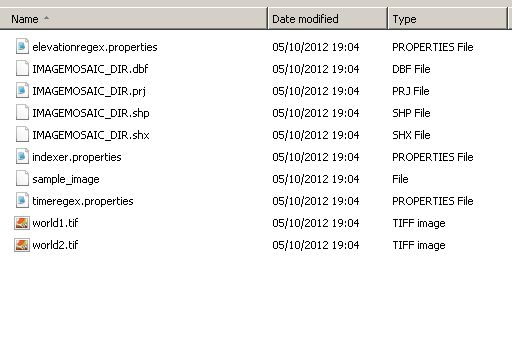

.. |GB| replace:: *GeoBatch*
.. |demo| replace:: *geobatch-demo*
.. |GS| replace:: *GeoServer*
.. |IM| replace:: ImageMosaic 

|IM| Action Demonstration
=========================

|IM| project uses |GB| to create an Image Mosaic on |GS|. 

The Image Mosaic Action you can use 2 types of input:
* An ImageMosaic command
* A directory with at least one geotiff file

The GeoTools Image Mosaic plugin used by geoserver can use two different type of storage for the spatial index:

* a database (you need to configure a 
* a shapefile.

For this |demo| we'll use an **Image Mosaic Command** with a **shapefile** to store the spatial index.

Setup the |demo| flow
---------------------

if you haven't already done, please read the demo setup :doc:`here <./demo0setup>`.

Into the ``data`` folder you may locate a file called ``ImageMosaicCommand.xml`` which need some modification based on your local paths:

Change the values in the brackets with your custom values:

* {SOURCE_DATA} * the ABSOLUTE path of the tif files with wich you want to add to the mosaic*
* {MOSAIC_DESTINATION} *the ABSOLUTE path of the directory where will be created the mosaic*

Optionally:

* {IMAGEMOSAIC_DIR_BACKUP} *a directory for granules backup*

Notes:
As you can see some value contained in the command are contained also in the flow configuration (imagemosaic.xml) .
In that case those contained in the commad will override the values specified in the flow configurations. 
Only if a value is NOT specified into the command the action will take that contained in flow configuration.
For example the value for *timeregex* is different. 
The regex is much simple as that contained in the flow config. 
The time specified in the file name (only the year) is simpler than that used in ImageMosaicAction Documentation so we have to use a different regex.

Running
-------

#. Go to http://localhost:8081/geobatch/flows.do You should see a started Image Mosaic Flow.
#. Copy the ImageMosaic  command and paste it into``imagemosaic_publish/in`` directory under your GEOBATCH CONFIG DIR.
#. Check the instances tab to see how they run.
#. Access to geoserver and verify that a new ImageMosaic Store is published.
#. You also should see the tiff granules that compose the mosaic under the MOSAIC_DESTINATION, the files elevationregex.properties and timeregex.properties that contain the regex specified into command, 3 file .dbf, .shp, .shx that are the shapefile and a file called sample_image.

Cleaning
--------

To completely remove the mosaic (needed if you want to run the same test) remember to:

* Remove the MOSAIC_DESTINATION directory
* Remove the relative store from geoserver

Optionally if you are using a database for stored index:

* Remove the relative table from the database
