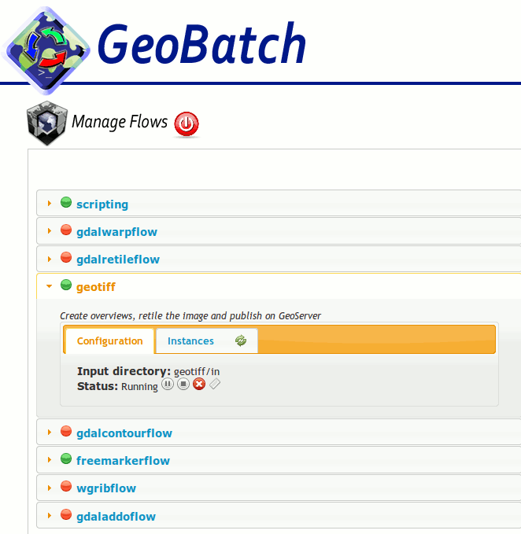

.. |GB| replace:: *GeoBatch*
.. |start| image:: images/start-icon.png
.. |config| image:: images/config-icon.png

Using |GB|
==========

Go to the |GB| web interface:

  http://localhost:8080/geobatch/

You should see |GB|'s main page:

.. figure:: images/main.png
   :align: center

Authentication
--------------

Clicking on any link, login screen appears:

.. figure:: images/login.png
   :align: center

Default user is ``admin``, default password is also ``admin``.

It's strong recommended to change the default admin password.

UserManagement and FTP server
-------------------

From main page, click on *Manage ftp and users*

You can configure or add users and specifyng FTP grant for each user.

For more info see section *Embedded FTP server and User Management*

Flow management
---------------

|GB| provide to User an usefull GUI with which start/stop and control each flow execution.

