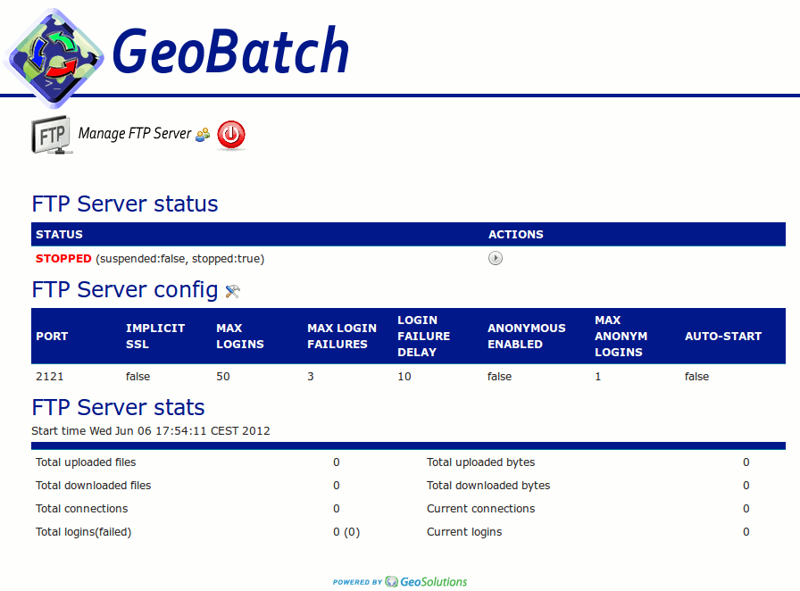

.. |GB| replace:: *GeoBatch*
.. |start| image:: images/start-icon.png
.. |config| image:: images/config-icon.png

Using |GB|
==========

Go to the |GB| web interface:

  http://localhost:8080/geobatch/

You should see |GB|'s main page:

.. figure:: images/main.png
   :align: center

Authentication
--------------

Clicking on any link, login screen appears:

.. figure:: images/login.png
   :align: center

Default user is ``admin``, default password is also ``admin``.

TODO: How to change.

Embedded FTP server
-------------------

From main page, click on *Manage ftp and users*:

There you can |config| configure the server, or |start| start it.

The configuration options are:

.. figure:: images/ftp_config.png
   :align: center

User management
---------------

To configure or add user click on the user icon near the log out button near the 'Manage FTP server'.

Flow management
---------------

.. figure:: images/flows.png
   :align: center

Configuring vsftpd
------------------

Edit service conf::

  $ nano /etc/vsftpd/vsftpd.conf

::

  -----------------vsftpd.conf----------------
  anonymous_enable=NO
  xferlog_file=/var/log/vsftpd.log
  file_open_mode=0770
  local_umask=007
  ...
  #Per user config
  user_config_dir=/etc/vsftpd/users/
  --------------------------------------------

::

  $ mkdir /etc/vsftpd/users

Edit each user (let's call it ``$USER``), conf::

  $ nano /etc/vsftpd/users/$USER

::

  -----------------$USER------------------
  local_root=/opt/ingestion/
  local_umask=0311
  dirlist_enable=NO
  file_open_mode=0466
  ----------------------------------------

Restart the service::

  $ /etc/init.d/vsftpd start
  $ chkconfig vsftpd on

